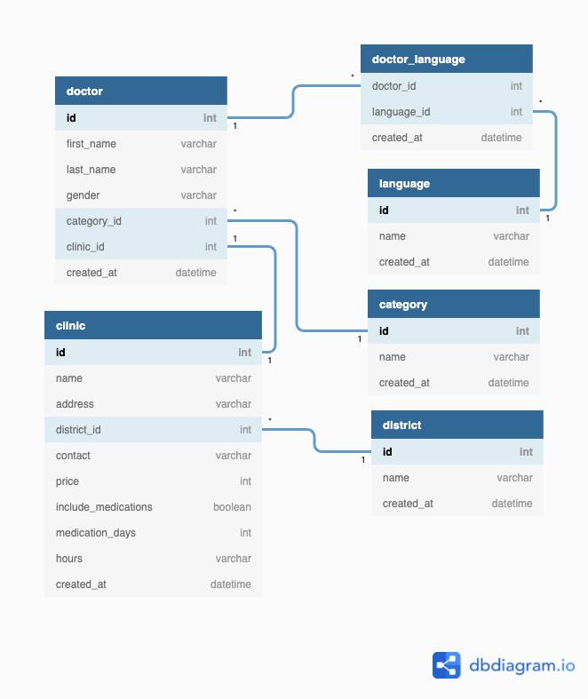

# Necktie Backend Take-Home Assessment

## Table of Contents

1. [Description](#description)
2. [Set-up Guide](#set-up-guide)
3. [Application Information](#application-information)
    - [Database Relationship Diagram](#relationship-diagram)
    - [Database Migration Commands](#database-migration)
    - [API Documentation](#documentation)
    - [Application Testing](#application-testing)
4. [Task Answers](#task-answers)

# Description

To build an API server to expose a Doctor List API for front-end
application to present the information to customers.

| Endpoints                     | Description                                                                                    |
| ----------------------------- | ---------------------------------------------------------------------------------------------- |
| https://{{domain}}/doctor     | To list all doctors and query doctors by `district`, `category`, `price range`, and `language` |
| https://{{domain}}/doctor/:id | To get a specific doctor by `id`                                                               |

## Python Version

```
Python 3.9.7
```

# Set-Up Guide

## Project Setup

```zsh
# Git clone project
git clone https://github.com/gigilaw/Gigi_Law_Backend_Engineer_Technical_Assessment.git

# Start virtual env
python3 -m venv venv

# Activate env
. venv/bin/activate

# Install required framework and libraries
pip3 install -r requirements.txt

# Create .env file based on .env.example
pbcopy < .env.example
pbpaste > .env

# Set environment variables
export FLASK_APP=app

# Turn on debugger for development environment
export FLASK_ENV=development
```

## Database Setup

```python
# Create sqlite DB
python3
from app import db
db.create_all()

# Seed db with starting data
python3 seed.py
```

## Start application

```zsh
# Start Flask
flask run
```

# Application Information

## Relationship Diagram



## Database migration

```zsh
# Update migration version
flask db migrate

# Run migration
flask db upgrade
```

## Documentation

### GET /doctor

```http
GET /doctor
```

| Query Parameters | Description                                      |
| :--------------- | :----------------------------------------------- |
| `categoryId`     | **optional**.                                    |
| `districtId`     | **optional**.                                    |
| `languageId`     | **optional**.                                    |
| `gt`             | **Requried for price_range query**. Greater than |
| `lt`             | **Requried for price_range query**. Less than    |

### Sample Success Response

```json
[
	{
		"category": {
			"id": 3,
			"name": "Cardiologist"
		},
		"clinic": {
			"address": "48290 Ross Corners Apt. 605\nChristopherberg, MT 71616",
			"contact": "761-697-4127x9538",
			"district": {
				"id": 1,
				"name": "Wan Chai"
			},
			"hours": "Monday: 9am-8pm, Friday: 9am-8pm, Saturday: closed, Sunday: closed, Public Holiday: closed",
			"id": 1,
			"include_medications": false,
			"medication_days": null,
			"name": "Moon Ltd Clinic",
			"price": 430
		},
		"first_name": "Luis",
		"last_name": "Medina",
		"id": 1
	},
	{
		"category": {
			"id": 3,
			"name": "Cardiologist"
		},
		"clinic": {
			"address": "Unit 5772 Box 0035\nDPO AP 77801",
			"contact": "0807345494",
			"district": {
				"id": 1,
				"name": "Wan Chai"
			},
			"hours": "Monday: 9am-8pm, Friday: 9am-8pm, Saturday: closed, Sunday: closed, Public Holiday: closed",
			"id": 2,
			"include_medications": false,
			"medication_days": null,
			"name": "Moreno, Hernandez and Beard Clinic",
			"price": 450
		},
		"first_name": "Brandon",
		"last_name": "Schneider",
		"id": 2
	}
]
```

### GET /doctor/:id

```http
GET /doctor/:id
```

| Query Parameter | Type      | Description                |
| :-------------- | :-------- | :------------------------- |
| `id`            | `integer` | **Required**. Id of doctor |

### Sample Success Response

```json
{
	"category": {
		"id": 1,
		"name": "General Practitioner"
	},
	"clinic": {
		"address": "3752 Vega Square\nTimothyport, NM 80530",
		"contact": "581-201-2681x011",
		"district": {
			"id": 1,
			"name": "Wan Chai"
		},
		"hours": "Monday: 9am-3pm, Tuesday: 9am-3pm, Wednesday: 9am-3pm, Thursday: 9am-3pm",
		"id": 1,
		"include_medications": true,
		"medication_days": 5,
		"name": "Klein Inc Clinic",
		"price": 840
	},
	"first_name": "Andy",
	"last_name": "April",
	"id": 1
}
```

### POST /doctor

```http
POST /doctor
```

| Parameters   | Type      | Description             |
| :----------- | :-------- | :---------------------- |
| `firstName`  | `string`  | **Required**.           |
| `lastName`   | `string`  | **Required**.           |
| `gender`     | `string`  | **Required**.           |
| `categoryId` | `integer` | **Required**.           |
| `clinicId`   | `integer` | **Required**.           |
| `languages`  | `array`   | **Required**. Ex. [1,2] |

### Sample Success Response

```json
{
	"category": {
		"id": 1,
		"name": "General Practitioner"
	},
	"clinic": {
		"address": "230 Regina Plaza Apt. 591\nScottberg, WA 83789",
		"contact": "893.679.6237",
		"district": {
			"id": 1,
			"name": "Wan Chai"
		},
		"hours": "Monday: 9am-8pm, Friday: 9am-8pm, Saturday: closed, Sunday: closed, Public Holiday: closed",
		"id": 2,
		"include_medications": false,
		"medication_days": null,
		"name": "Lowe and Sons Clinic",
		"price": 940
	},
	"first_name": "333",
	"last_name": "def",
	"id": 1
}
```

## Application Testing

```zsh
# Run tests
python3 test_api.py
```

# Task Answers

1. Choice of Framework & Library: Please explain why you choose the particular
   framework or library.

    - What are the benefits & drawbacks associated with that choice?
    - What are the assumptions underlying that choice?

    ```
    After researching for some potential frameworks, I chose to use Flask framework for its lightweight, ease to use, and vast resources through the community that has built it. I made the assumption that only 2 endpoints will be consumed and thus I wanted to pick a micro-framework to deliver fast performance. As someone who is not too familiar with python, a framework having a lot of support, documentation, and questions raised was a huge advantage for me as I was able to draw from all those who has come before, and use their knowledge and experiences as my guidance to complete this project. One of the main drawbacks would be not being standardized. Due to the nature of the framework not being very opinionated, so it makes it hard to adjust for developers and will have to take extra time to research on what would be the best for implementations.

    I didn’t install too many extra libraries apart from the ones to start with Flask. However, to complete the task, I installed some Flask extensions that will help with maneuvering the database (Flask-SQLAlchemy), present the data in schema (Flask-Marshmallow), run migrations (Flask-Migrate), run tests through requests (Requests), and load .env files (python-dotenv). I mainly chose the above libraries for its ease of integration with Flask itself.
    ```

2. Potential Improvement: Please elaborate on what kind of improvements you
   would like to implement if you have given more time.

    ```
    If I were given more time, I would like to implement the following:

    1. Folder structure
         - Since the application is not too big, I did not implement a specific structure for it. But reading through the Flask Documentations, as this application grows, I would like to implement Blueprints concept for better structuring and readability

    2. Health check of the application

    3. Performance metrics

    4. Pagination

    5. Validation of the request passed

    6. Custom exceptions
    ```

3. Production consideration: Any extra steps should be taken with caution when
   deploying your app to a production environment?

    ```
    It is important to make sure there are no production variables are in the .env.example file. I kept the values in there for ease of creating the .env file but in the production environment, it should be taken out. It is also important to separate development and production databases and not mistakenly run migration on the production database.
    ```

4. Assumptions
    - Any assumptions you have made when you designed the data model and
      API schema?
    - Any other assumptions and opinions you have taken throughout the
      assessments?
    ```
    An assumption I made when designing the data model was that both Doctor and Clinic and Doctor and Category have a one-to-one relationship. The case in reality was not as clear cut as a Doctor and Language many-to-many relationship and so for ease of building the model, I had to make this assumption. I had also assumed that the request will be passed by json.
    ```
